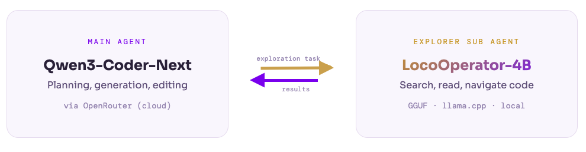

<div align="center">
  
</div>

<br>

<div align="center">

[](https://huggingface.co/LocoreMind/LocoOperator-4B)
[](https://locoremind.com/blog/loco-operator)
[](https://github.com/LocoreMind/LocoOperator)
[](https://colab.research.google.com/github/LocoreMind/LocoOperator/blob/main/LocoOperator_4B.ipynb)

</div>

> **LocoOperator-4B** is a 4B-parameter code exploration agent distilled from Qwen3-Coder-Next. Designed as a local sub agent for Claude Code-style agent loops — fast codebase navigation at zero API cost.

## 📋 Table of Contents

- 📰 [News & Updates](#-news--updates)
- 📝 [Introduction](#-introduction)
- ✨ [Key Features](#-key-features)
- 🏗️ [Architecture](#️-architecture)
- 📈 [Performance](#-performance)
- 🚀 [Quick Start](#-quick-start)
- 🔧 [Analysis Pipeline](#-analysis-pipeline)
- 📁 [Project Structure](#-project-structure)
- ⚠️ [Known Limitations](#️-known-limitations)
- 📄 [License](#-license)
- 🙏 [Acknowledgments](#-acknowledgments)

## 📰 News & Updates

- **\[2026-02-23\]** 🎉 LocoOperator-4B model card and evaluation analysis released.
- **\[2026-02-20\]** 🚀 LocoOperator-4B (Step 2524) training completed. GGUF quantized for local deployment.

## 📝 Introduction

LocoOperator-4B is a tool-calling agent model trained via knowledge distillation from **Qwen3-Coder-Next** inference traces. It specializes in multi-turn codebase exploration — reading files, searching code, and navigating project structures within a Claude Code-style agent loop.

<div align="center">

|  | LocoOperator-4B |
|:--|:--|
| **Base Model** | [Qwen3-4B-Instruct-2507](https://huggingface.co/Qwen/Qwen3-4B-Instruct-2507) |
| **Teacher Model** | Qwen3-Coder-Next |
| **Training Method** | Full-parameter SFT (distillation) |
| **Training Data** | 170,356 multi-turn conversation samples |
| **Max Sequence Length** | 16,384 tokens |
| **Training Hardware** | 4x NVIDIA H200 141GB SXM5 |
| **Training Time** | ~25 hours |
| **Framework** | MS-SWIFT |

</div>

## ✨ Key Features

- 🔧 **Tool-Calling Agent**: Generates structured `<tool_call>` JSON for Read, Grep, Glob, Bash, Write, Edit, and Task (subagent delegation)
- 🎯 **100% JSON Validity**: Every tool call is valid JSON with all required arguments — outperforming the teacher model (87.6%)
- 🏠 **Local Deployment**: GGUF quantized, runs on Mac Studio via llama.cpp at zero API cost
- ⚡ **Lightweight Explorer**: 4B parameters, optimized for fast codebase search and navigation
- 🔄 **Multi-Turn**: Handles conversation depths of 3–33 messages with consistent tool-calling behavior

## 🏗️ Architecture

LocoOperator-4B operates as a **sub agent (explorer)** within a two-tier agent system:

<div align="center">
  
</div>

The main agent handles decision-making and code generation while delegating codebase exploration to LocoOperator-4B — keeping API costs low and latency minimal.

## 📈 Performance

Evaluated on 65 multi-turn conversation samples from diverse open-source projects (scipy, fastapi, arrow, attrs, gevent, gunicorn, etc.), with labels generated by Qwen3-Coder-Next.

### Core Metrics

<div align="center">

| Metric | Score |
|:-------|:-----:|
| **Tool Call Presence Alignment** | **100%** (65/65) |
| **First Tool Type Match** | **65.6%** (40/61) |
| **JSON Validity** | **100%** (76/76) |
| **Argument Syntax Correctness** | **100%** (76/76) |

</div>

The model perfectly learned *when* to use tools vs. when to respond with text (100% presence alignment). Tool type mismatches are between semantically similar tools (e.g. Grep vs Read) — different but often valid strategies.

### Tool Distribution Comparison

<div align="center">

| Tool | LocoOperator-4B | Qwen3-Coder-Next | Delta |
|:-----|:---------------:|:-----------------:|:-----:|
| Read | 22 | 32 | -10 |
| Bash | 22 | 17 | +5 |
| Grep | 14 | 18 | -4 |
| Glob | 9 | 11 | -2 |
| Task | 7 | 7 | 0 |
| Write | 2 | 3 | -1 |
| **Total** | **76** | **89** | **-13** |

</div>

### JSON & Argument Syntax Correctness

<div align="center">

| Model | JSON Valid | Argument Syntax Valid |
|:------|:---------:|:--------------------:|
| **LocoOperator-4B** | 76/76 (100%) | 76/76 (100%) |
| Qwen3-Coder-Next (teacher) | 89/89 (100%) | 78/89 (87.6%) |

</div>

> LocoOperator-4B achieves perfect structured output. The teacher model has 11 tool calls with missing required arguments (empty `arguments: {}`).

## 🚀 Quick Start

### Prerequisites

- **Claude Code** — `npm install -g @anthropic-ai/claude-code`
- **llama.cpp** — build from source or `brew install llama.cpp`
- **uv** — `curl -LsSf https://astral.sh/uv/install.sh | sh`
- **OpenRouter API key** — https://openrouter.ai/keys

### Serve with llama.cpp

```bash
# Download the GGUF model
# (replace with actual model path)

# Start the server
./llama-server \
    -m LocoOperator-4B.gguf \
    --ctx-size 51200 \
    --host 0.0.0.0 \
    --port 8080
```

### Recommended Settings

| Parameter | Value | Rationale |
|:----------|:------|:----------|
| Context size | 50K | Covers multi-turn exploration with room for tool outputs |
| Max turns | 10 | Sufficient for focused codebase exploration tasks |
| Temperature | 0.7 | Balanced between determinism and exploration |

## 🔧 Analysis Pipeline

This repo includes a hybrid analysis pipeline that combines LocoOperator-4B (local) with a cloud LLM via OpenRouter, orchestrated through `claude -p`.

```
claude -p (sonnet) ──→ proxy (9091) ──→ OpenRouter Qwen3-Coder-Next
  └─ subagent (haiku) ─→ proxy (9091) ──→ local llama-server (8080)
```

The main agent runs as sonnet (cloud), and when it spawns subagents (Task tool) they default to haiku, which the proxy routes to the local 4B model. If the local model hits context limits or exceeds 10 turns, the proxy automatically falls back to OpenRouter.

The proxy (`scripts/proxy.py`) handles:
- Anthropic Messages API ↔ OpenAI Chat Completions format conversion for the local model
- Parsing `<tool_call>` text output from the local model back into Anthropic tool_use blocks
- Automatic fallback to OpenRouter on context overflow

### Setup

```bash
# Install Python dependencies
uv sync

# Configure your OpenRouter API key
cp .env.example .env
# Edit .env and set OPENROUTER_API_KEY
```

`.claude/settings.local.json` is auto-generated on first run from your `.env` key. No need to create it manually.

Place your GGUF model at `models/LocoOperator-4B-GGUF/LocoOperator-4B.gguf`.

Place target projects under `data/repos/`.

### Single query test

```bash
./scripts/test_single.sh tqdm "How does tqdm detect if running in a Jupyter notebook?"
```

### Batch analyze

```bash
./scripts/analyze.sh tqdm
```

This reads queries from `data/queries/tqdm-queries.txt` and saves results to `data/outputs/tqdm/`.

### Adding More Projects

1. Clone a project into `data/repos/`:
   ```bash
   git clone --depth 1 https://github.com/user/repo data/repos/repo
   rm -rf data/repos/repo/.git
   ```
2. Create a queries file at `data/queries/repo-queries.txt` (tab-separated `id\tquery`)
3. Run: `./scripts/analyze.sh repo`

## 📁 Project Structure

```
LocoOperator/
├── .env.example                         # OpenRouter key template
├── pyproject.toml
├── models/LocoOperator-4B-GGUF/
│   └── LocoOperator-4B.gguf
├── examples/                            # model inference examples
│   ├── quick_start.py
│   └── codebase_analysis_example.py
├── data/
│   ├── repos/                           # target projects to analyze
│   ├── queries/tqdm-queries.txt         # analysis queries (tab-separated: id\tquery)
│   └── outputs/                         # analysis results
├── prompts/
│   └── analyze_query.txt                # prompt template
└── scripts/
    ├── proxy.py                         # hybrid routing proxy
    ├── setup.sh                         # auto-generates .claude/settings.local.json
    ├── start_services.sh                # auto-starts llama-server + proxy
    ├── analyze.sh                       # batch analysis runner
    └── test_single.sh                   # single query test
```

## Training Details

<details>
  <summary>📋 Click to expand full training configuration</summary>

| Parameter | Value |
|:----------|:------|
| Base model | Qwen3-4B-Instruct-2507 |
| Teacher model | Qwen3-Coder-Next |
| Method | Full-parameter SFT |
| Training data | 170,356 samples |
| Hardware | 4x NVIDIA H200 141GB SXM5 |
| Parallelism | DDP (no DeepSpeed) |
| Precision | BF16 |
| Epochs | 1 |
| Batch size | 2/GPU, gradient accumulation 4 (effective batch 32) |
| Learning rate | 2e-5, warmup ratio 0.03 |
| Max sequence length | 16,384 tokens |
| Template | qwen3_nothinking |
| Framework | MS-SWIFT |
| Training time | ~25 hours |
| Checkpoint | Step 2524 |

</details>

## ⚠️ Known Limitations

- First-tool-type match is 65.6% — the model sometimes picks a different (but not necessarily wrong) tool than the teacher
- Tends to under-generate parallel tool calls compared to the teacher (76 vs 89 total calls across 65 samples)
- Preference for Bash over Read may indicate the model defaults to shell commands where file reads would be more appropriate
- Evaluated on 65 samples only; larger-scale evaluation needed

## 📄 License

This project is licensed under the MIT License - see the [LICENSE](LICENSE) file for details.

## 🙏 Acknowledgments

- 🤖 **[Qwen Team](https://huggingface.co/Qwen)** for the Qwen3-4B-Instruct-2507 base model
- 🛠️ **[MS-SWIFT](https://github.com/modelscope/ms-swift)** for the training framework
- 🦙 **[llama.cpp](https://github.com/ggerganov/llama.cpp)** for efficient local inference
- 🤖 **[Anthropic](https://www.anthropic.com/)** for the Claude Code agent loop design that inspired this work
